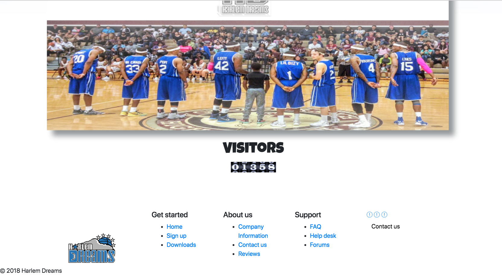

<snippet>
  <content><![CDATA[
# ${Harlem Dreams}
TODO: Project was for a Show Ball team based in California. They travel around the country and world and perform shows for family outtings.
## Installation
    Was installed using Ubuntu 16.04

]]></content>
  <tabTrigger>readme</tabTrigger>
</snippet>